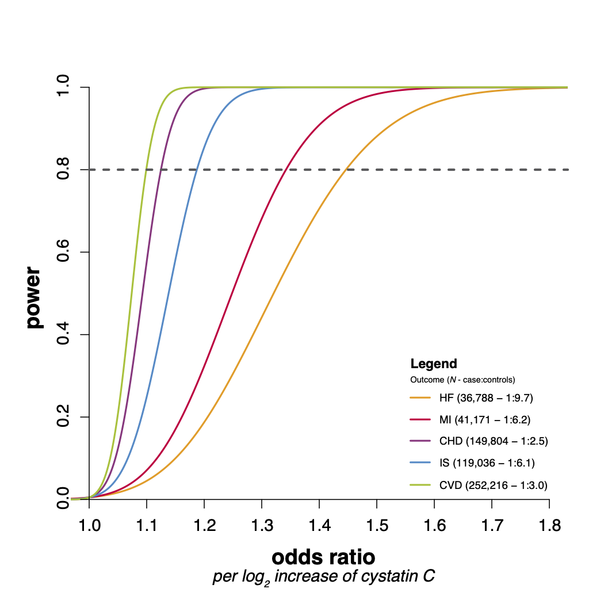

Cystatin C and Cardiovascular Disease: A Mendelian Randomization Study
===========================================================

#### This readme
This readme accompanies the paper "Cystatin C and Cardiovascular Disease: A Mendelian Randomization Study." by [Van der Laan S.W. *et al*. **JACC 2016**](https://doi.org/10.1016/j.jacc.2016.05.092).

#### Abstract
**Background** Epidemiological studies show that high circulating cystatin C is associated with risk of cardiovascular disease (CVD), independent of creatinine-based renal function measurements. It is unclear whether this relationship is causal, arises from residual confounding, and/or is a consequence of reverse causation.

**Objectives** The aim of this study was to use Mendelian randomization to investigate whether cystatin C is causally related to CVD in the general population.

**Methods** We incorporated participant data from 16 prospective cohorts (n = 76,481) with 37,126 measures of cystatin C and added genetic data from 43 studies (n = 252,216) with 63,292 CVD events. We used the common variant rs911119 in CST3 as an instrumental variable to investigate the causal role of cystatin C in CVD, including coronary heart disease, ischemic stroke, and heart failure.

**Results** Cystatin C concentrations were associated with CVD risk after adjusting for age, sex, and traditional risk factors (relative risk: 1.82 per doubling of cystatin C; 95% confidence interval [CI]: 1.56 to 2.13; p = 2.12 × 10−14). The minor allele of rs911119 was associated with decreased serum cystatin C (6.13% per allele; 95% CI: 5.75 to 6.50; p = 5.95 × 10−211), explaining 2.8% of the observed variation in cystatin C. Mendelian randomization analysis did not provide evidence for a causal role of cystatin C, with a causal relative risk for CVD of 1.00 per doubling cystatin C (95% CI: 0.82 to 1.22; p = 0.994), which was statistically different from the observational estimate (p = 1.6 × 10−5). A causal effect of cystatin C was not detected for any individual component of CVD.

**Conclusions** Mendelian randomization analyses did not support a causal role of cystatin C in the etiology of CVD. As such, therapeutics targeted at lowering circulating cystatin C are unlikely to be effective in preventing CVD.

Here you can find the R-script used to calculate power, `MR_Power_Binary.R`, which generates the graph below.

#### Notes
Scripts will work within the context of a certain Linux environment, for example a CentOS7 system on a SUN Grid Engine background or macOS X Lion+ (version 10.7.[x]+). 

--------------

#### The MIT License (MIT)
##### Copyright (c) 1979-present Sander W. van der Laan | s.w.vanderlaan [at] gmail [dot] com.

Permission is hereby granted, free of charge, to any person obtaining a copy of this software and associated documentation files (the "Software"), to deal in the Software without restriction, including without limitation the rights to use, copy, modify, merge, publish, distribute, sublicense, and/or sell copies of the Software, and to permit persons to whom the Software is furnished to do so, subject to the following conditions:   

The above copyright notice and this permission notice shall be included in all copies or substantial portions of the Software.

THE SOFTWARE IS PROVIDED "AS IS", WITHOUT WARRANTY OF ANY KIND, EXPRESS OR IMPLIED, INCLUDING BUT NOT LIMITED TO THE WARRANTIES OF MERCHANTABILITY, FITNESS FOR A PARTICULAR PURPOSE AND NONINFRINGEMENT. IN NO EVENT SHALL THE AUTHORS OR COPYRIGHT HOLDERS BE LIABLE FOR ANY CLAIM, DAMAGES OR OTHER LIABILITY, WHETHER IN AN ACTION OF CONTRACT, TORT OR OTHERWISE, ARISING FROM, OUT OF OR IN CONNECTION WITH THE SOFTWARE OR THE USE OR OTHER DEALINGS IN THE SOFTWARE.

Reference: http://opensource.org.
